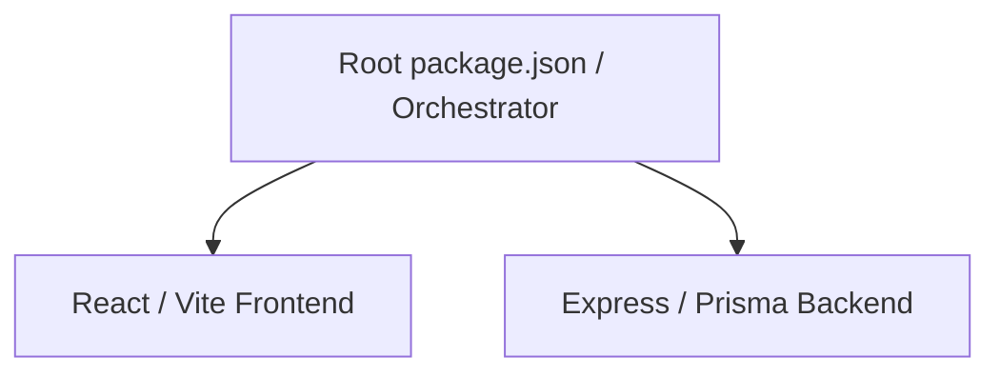

# Project Structure

## Architecture Overview
The CareConnect repository uses an orchestrated monorepo structure.

## Directory Details
- `/` (Root): Orchestrates the development, linting, and build cycles using `npm --prefix`. Houses the Vite configurations for the frontend.
- `/src`: Contains the entire React application frontend.
- `/server`: Contains the Express.js application, Prisma schemas, database migrations, and API routes.
- `/server/src/modules`: Domain-driven modular layout for the backend (e.g., `auth`, `courses`).
- `/scripts`: Cross-platform Node.js scripts handling environment setup, cleanup, and health checks.
